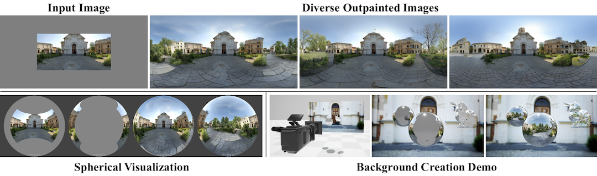

# Diverse Plausible 360-Degree Image Outpainting for Efficient 3DCG Background Creation



[**Diverse Plausible 360-Degree Image Outpainting for Efficient 3DCG Background Creation**](https://akmtn.github.io/omni-dreamer/) (CVPR 2022)<br/>
[Naofumi Akimoto](https://akmtn.github.io/resume.pdf), 
[Yuhi Matsuo](https://ishyuhi.github.io/ImsoHappyYuhi),
[Yoshimitsu Aoki](https://aoki-medialab.jp/home-en/)<br/>


[arXiv](http://arxiv.org/abs/2203.14668) | [BibTeX](#bibtex) | [Project Page](https://akmtn.github.io/omni-dreamer/) | [Supp Video](https://www.youtube.com/watch?v=FxfudEt_Fds)

## Requirements
A suitable [conda](https://conda.io/) environment named `omnidreamer` can be created
and activated with:

```
conda env create -f environment.yaml
conda activate omnidreamer
```


## Trained models
Please send us an email. We will send you the URL for downloading. You may distribute the trained models to others, but please do not reveal the URL.


## Running trained models
- Put trained weights under `logs/`
- Comment out `ckpt_path` to VQGAN models from each `{*}-project.yaml`


## Inference examples
### Sampling for a comparison against 360IC
```
CUDA_VISIBLE_DEVICES=0 python sampling.py \
--config_path logs/2021-07-27T05-57-41_sun360_basic_transformer/configs/2021-07-27T05-57-41-project.yaml \
--ckpt_path logs/2021-07-27T05-57-41_sun360_basic_transformer/checkpoints/last.ckpt \
--config_path_2 logs/2021-07-27T10-49-57_sun360_refine_net/configs/2021-07-27T10-49-57-project.yaml \
--ckpt_path_2 logs/2021-07-27T10-49-57_sun360_refine_net/checkpoints/last.ckpt \
--outdir outputs/test
```

### Sampling for a comparison against SIG-SS
```
CUDA_VISIBLE_DEVICES=0 python sampling.py \
--config_path logs/2021-07-27T05-57-41_sun360_basic_transformer/configs/2021-07-27T05-57-41-project.yaml \
--ckpt_path logs/2021-07-27T05-57-41_sun360_basic_transformer/checkpoints/last.ckpt \
--config_path_2 logs/2021-07-27T10-49-57_sun360_refine_net/configs/2021-07-27T10-49-57-project.yaml \
--ckpt_path_2 logs/2021-07-27T10-49-57_sun360_refine_net/checkpoints/last.ckpt \
--mask_path assets/90binarymask.png \
--outdir outputs/test
```


### Sampling for a comparison against EnvMapNet
```
CUDA_VISIBLE_DEVICES=0 python sampling.py \
--config_path logs/2021-08-12T03-27-04_sun360_basic_transformer/configs/2021-08-12T03-27-04-project.yaml \
--ckpt_path logs/2021-08-12T03-27-04_sun360_basic_transformer/checkpoints/last.ckpt \
--config_path_2 logs/2021-08-12T03-42-53_sun360_refine_net/configs/2021-08-12T03-42-53-project.yaml \
--ckpt_path_2 logs/2021-08-12T03-42-53_sun360_refine_net/checkpoints/last.ckpt \
--mask_path assets/90binarymask.png \
--outdir outputs/test
```

## Training
We train the four networks separately (VQGAN_1, VQGAN_2, Transformer, and AdjustmentNet).  
**Order of training**
- For the training of the Transformer, trained VQGAN_1 and VQGAN_2 are required.
- For the training of AdjustmentNet (RefineNet), trained VQGAN_2 is required.
- Therefore, VQGAN_1 and VQGAN_2 can be trained in parallel, and Transformer and AdjustmentNet (RefineNet) can also be trained in parallel.

**Sample Commands**
- VQGAN_1  
See `configs/sun360_comp_vqgan.yaml` for the details. Run it with `image_key: concat_input`, `concat_input: True`, `in_channels: 7`, and `out_ch: 7`.
We trained 30 epochs totaly (only for transformer, 15).
```
CUDA_DEVICE_ORDER=PCI_BUS_ID CUDA_VISIBLE_DEVICES=0,1 python main.py --base configs/sun360_comp_vqgan.yaml -t True --gpus 0,1
```

- VQGAN_2  
Use `configs/sun360_comp_vqgan.yaml` for VQGAN_2, that is the same configuration file, but set `image_key: image`, `concat_input: False`, `in_channels: 3`, and `out_ch: 3`.
```
CUDA_DEVICE_ORDER=PCI_BUS_ID CUDA_VISIBLE_DEVICES=0,1 python main.py --base configs/sun360_comp_vqgan.yaml -t True --gpus 0,1
```

- Transformer  
Write the paths of the trained VQGAN_1 and VQGAN_2 in the yaml configuration file `configs/sun360_basic_transformer.yaml`.
Even if you train VQGAN with 256x256 images before, you can train a transformer with 256x512. If using 256x512, set `block size: 1024`.
```
CUDA_DEVICE_ORDER=PCI_BUS_ID CUDA_VISIBLE_DEVICES=0,1 python main.py --base configs/sun360_basic_transformer.yaml -t True --gpus 0,1
```

- RefineNet(AdjustmentNet)  
Write the paths of the trained VQGAN_2 in the yaml configuration file `configs/sun360_refine_net.yaml`.
```
CUDA_DEVICE_ORDER=PCI_BUS_ID CUDA_VISIBLE_DEVICES=0,1 python main.py --base configs/sun360_refine_net.yaml -t True --gpus 0,1
```


## Development environment
- Ubuntu 18.04
- Titan RTX or RTX 3090
- CUDA11


## License
This repo is built on top of VQGAN. See the [license](https://github.com/CompVis/taming-transformers/blob/master/License.txt).


## BibTeX
```
@inproceedings{akimoto2022diverse,
    author    = {Akimoto, Naofumi and Matsuo, Yuhi and Aoki, Yoshimitsu},
    title     = {Diverse Plausible 360-Degree Image Outpainting for Efficient 3DCG Background Creation},
    booktitle   = {Proceedings of the IEEE/CVF Conference on Computer Vision and Pattern Recognition (CVPR)},
    year      = {2022},
}
```